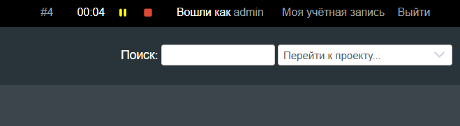

# Redmine Timetracker Plugin

The plugin allows you to track the time spent on completing a task. It is possible to pause the timer and then continue. The Redmine 6+ version is supported (it is likely that later versions are also supported, but I`m not sure).



## Install

Clone this repository to the `plugins` directory and restart Redmine.

```sh
cd /path/to/redmine/plugins

git clone https://github.com/nspotapov/redmine_timetracker_plugin
```

The plugin uses only JavaScript and stores timer data in localStorage, so migrations are not required.
